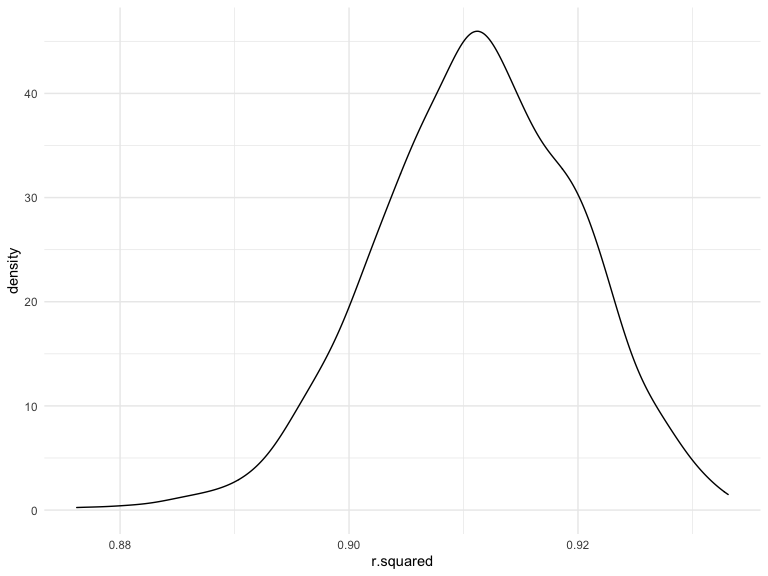

p8105 Homework 6
================

### Problem 1

To obtain a distribution for $\hat{r}^2$, we’ll follow basically the
same procedure we used for regression coefficients: draw bootstrap
samples; the a model to each; extract the value I’m concerned with; and
summarize. Here, we’ll use `modelr::bootstrap` to draw the samples and
`broom::glance` to produce `r.squared` values.

``` r
weather_df = 
  rnoaa::meteo_pull_monitors(
    c("USW00094728"),
    var = c("PRCP", "TMIN", "TMAX"), 
    date_min = "2017-01-01",
    date_max = "2017-12-31") %>%
  mutate(
    name = recode(id, USW00094728 = "CentralPark_NY"),
    tmin = tmin / 10,
    tmax = tmax / 10) %>%
  select(name, id, everything())
```

    ## Registered S3 method overwritten by 'hoardr':
    ##   method           from
    ##   print.cache_info httr

    ## using cached file: ~/Library/Caches/R/noaa_ghcnd/USW00094728.dly

    ## date created (size, mb): 2022-10-12 19:47:42 (8.411)

    ## file min/max dates: 1869-01-01 / 2022-10-31

``` r
weather_df %>% 
  modelr::bootstrap(n = 1000) %>% 
  mutate(
    models = map(strap, ~lm(tmax ~ tmin, data = .x) ),
    results = map(models, broom::glance)) %>% 
  select(-strap, -models) %>% 
  unnest(results) %>% 
  ggplot(aes(x = r.squared)) + geom_density()
```



In this example, the $\hat{r}^2$ value is high, and the upper bound at 1
may be a cause for the generally skewed shape of the distribution. If we
wanted to construct a confidence interval for $R^2$, we could take the
2.5% and 97.5% quantiles of the estimates across bootstrap samples.
However, because the shape isn’t symmetric, using the mean +/- 1.96
times the standard error probably wouldn’t work well.

We can produce a distribution for $\log(\beta_0 * \beta1)$ using a
similar approach, with a bit more wrangling before we make our plot.

``` r
weather_df %>% 
  modelr::bootstrap(n = 1000) %>% 
  mutate(
    models = map(strap, ~lm(tmax ~ tmin, data = .x) ),
    results = map(models, broom::tidy)) %>% 
  select(-strap, -models) %>% 
  unnest(results) %>% 
  select(id = `.id`, term, estimate) %>% 
  pivot_wider(
    names_from = term, 
    values_from = estimate) %>% 
  rename(beta0 = `(Intercept)`, beta1 = tmin) %>% 
  mutate(log_b0b1 = log(beta0 * beta1)) %>% 
  ggplot(aes(x = log_b0b1)) + geom_density()
```


As with $r^2$, this distribution is somewhat skewed and has some
outliers.

The point of this is not to say you should always use the bootstrap –
it’s possible to establish “large sample” distributions for strange
parameters / values / summaries in a lot of cases, and those are great
to have. But it is helpful to know that there’s a way to do inference
even in tough cases.

### Problem 2

``` r
homicide_data = read_csv("./data/homicide_data.csv")
```

    ## Rows: 52179 Columns: 12
    ## ── Column specification ────────────────────────────────────────────────────────
    ## Delimiter: ","
    ## chr (9): uid, victim_last, victim_first, victim_race, victim_age, victim_sex...
    ## dbl (3): reported_date, lat, lon
    ## 
    ## ℹ Use `spec()` to retrieve the full column specification for this data.
    ## ℹ Specify the column types or set `show_col_types = FALSE` to quiet this message.

-   Create a `city_state` variable (e.g. “Baltimore, MD”), and a binary
    variable indicating whether the homicide is solved. Omit cities
    Dallas, TX; Phoenix, AZ; and Kansas City, MO – these don’t report
    victim race. Also omit Tulsa, AL – this is a data entry mistake. For
    this problem, limit your analysis those for whom `victim_race` is
    `white` or `black`. Be sure that `victim_age` is numeric.

``` r
homicide = homicide_data %>% 
  mutate(
    city_state = str_c(city, ', ', state),
    solved = ifelse(disposition %in% c("Closed without arrest", "Open/No arrest"), FALSE, TRUE),
    victim_age = as.numeric(victim_age)
  ) %>% 
  filter(
    !city_state %in% c("Dallas, TX", "Phoenix, AZ", "Kansas City, MO", "Tulsa, AL"),
    victim_race %in% c("White", "Black")
    )
```

-   For the city of Baltimore, MD, use the `glm` function to fit a
    logistic regression with resolved vs unresolved as the outcome and
    victim age, sex and race as predictors. Save the output of `glm` as
    an R object; apply the `broom::tidy` to this object; and obtain the
    estimate and confidence interval of the adjusted **odds ratio** for
    solving homicides comparing male victims to female victims keeping
    all other variables fixed.

``` r
baltimore_df = 
  homicide %>% 
  filter(city == "Baltimore")

bal_logistic = 
  baltimore_df %>% 
  glm(solved ~ victim_age + victim_sex + victim_race, data = ., family = binomial()) %>% 
  broom::tidy()

bal_logistic
```

    ## # A tibble: 4 × 5
    ##   term             estimate std.error statistic  p.value
    ##   <chr>               <dbl>     <dbl>     <dbl>    <dbl>
    ## 1 (Intercept)       0.310     0.171        1.81 7.04e- 2
    ## 2 victim_age       -0.00673   0.00332     -2.02 4.30e- 2
    ## 3 victim_sexMale   -0.854     0.138       -6.18 6.26e-10
    ## 4 victim_raceWhite  0.842     0.175        4.82 1.45e- 6

``` r
bal_logistic %>% 
  mutate(
    OR = exp(estimate),
    conf_low = exp(estimate - 1.96 * std.error),
    conf_high = exp(estimate + 1.96 * std.error)) %>%
  select(term, Log_OR = estimate, OR, conf_low, conf_high) %>% 
  filter(term == "victim_sexMale") %>% 
  knitr::kable(digits = 3)
```

| term           | Log_OR |    OR | conf_low | conf_high |
|:---------------|-------:|------:|---------:|----------:|
| victim_sexMale | -0.854 | 0.426 |    0.325 |     0.558 |

The output of `glm` was saved as `bal_logistic`. As shown in the output,
for solving homicides comparing male victims to female victims keeping
all other variables fixed, the estimate adjusted OR is 0.426, and
confidence interval of the adjusted OR is (0.325, 0.558).

-   Now run `glm` for each of the cities in your dataset, and extract
    the adjusted odds ratio (and CI) for solving homicides comparing
    male victims to female victims. Do this within a “tidy” pipeline,
    making use of `purrr::map`, list columns, and `unnest` as necessary
    to create a dataframe with estimated ORs and CIs for each city.

Firstly, write a function:

``` r
city_logistic = function(df) {
  
    glm(solved ~ victim_age + victim_sex + victim_race, data = df, family = binomial()) %>% 
    broom::tidy() %>% 
    mutate(
      OR = exp(estimate),
      conf_low = exp(estimate - 1.96 * std.error),
      conf_high = exp(estimate + 1.96 * std.error)) %>%
    select(term, Log_OR = estimate, OR, conf_low, conf_high)
  
}
```

Apply this function to the `homicide` dataframe:

``` r
cities_logistic = 
  homicide %>% 
  filter(victim_sex %in% c("Female", "Male")) %>% 
  nest(df = -city_state) %>% 
  mutate(
    outcome = map(df, city_logistic)
  ) %>% 
  unnest(outcome) %>% 
  select(-df) %>% 
  filter(term == "victim_sexMale")
```

Here is the dataframe with estimated adjusted ORs and CIs for each city
for solving homicides comparing male victims to female victims.

``` r
cities_logistic %>% 
  knitr::kable(digits = 3)
```

| city_state         | term           | Log_OR |    OR | conf_low | conf_high |
|:-------------------|:---------------|-------:|------:|---------:|----------:|
| Albuquerque, NM    | victim_sexMale |  0.570 | 1.767 |    0.831 |     3.761 |
| Atlanta, GA        | victim_sexMale |  0.000 | 1.000 |    0.684 |     1.463 |
| Baltimore, MD      | victim_sexMale | -0.854 | 0.426 |    0.325 |     0.558 |
| Baton Rouge, LA    | victim_sexMale | -0.964 | 0.381 |    0.209 |     0.695 |
| Birmingham, AL     | victim_sexMale | -0.139 | 0.870 |    0.574 |     1.318 |
| Boston, MA         | victim_sexMale | -0.404 | 0.667 |    0.354 |     1.260 |
| Buffalo, NY        | victim_sexMale | -0.653 | 0.521 |    0.290 |     0.935 |
| Charlotte, NC      | victim_sexMale | -0.123 | 0.884 |    0.557 |     1.403 |
| Chicago, IL        | victim_sexMale | -0.891 | 0.410 |    0.336 |     0.501 |
| Cincinnati, OH     | victim_sexMale | -0.917 | 0.400 |    0.236 |     0.677 |
| Columbus, OH       | victim_sexMale | -0.630 | 0.532 |    0.378 |     0.750 |
| Denver, CO         | victim_sexMale | -0.736 | 0.479 |    0.236 |     0.971 |
| Detroit, MI        | victim_sexMale | -0.541 | 0.582 |    0.462 |     0.734 |
| Durham, NC         | victim_sexMale | -0.208 | 0.812 |    0.392 |     1.683 |
| Fort Worth, TX     | victim_sexMale | -0.402 | 0.669 |    0.397 |     1.127 |
| Fresno, CA         | victim_sexMale |  0.289 | 1.335 |    0.580 |     3.071 |
| Houston, TX        | victim_sexMale | -0.341 | 0.711 |    0.558 |     0.907 |
| Indianapolis, IN   | victim_sexMale | -0.085 | 0.919 |    0.679 |     1.242 |
| Jacksonville, FL   | victim_sexMale | -0.329 | 0.720 |    0.537 |     0.966 |
| Las Vegas, NV      | victim_sexMale | -0.178 | 0.837 |    0.608 |     1.154 |
| Long Beach, CA     | victim_sexMale | -0.891 | 0.410 |    0.156 |     1.082 |
| Los Angeles, CA    | victim_sexMale | -0.413 | 0.662 |    0.458 |     0.956 |
| Louisville, KY     | victim_sexMale | -0.712 | 0.491 |    0.305 |     0.790 |
| Memphis, TN        | victim_sexMale | -0.324 | 0.723 |    0.529 |     0.988 |
| Miami, FL          | victim_sexMale | -0.663 | 0.515 |    0.304 |     0.872 |
| Milwaukee, wI      | victim_sexMale | -0.319 | 0.727 |    0.499 |     1.060 |
| Minneapolis, MN    | victim_sexMale | -0.054 | 0.947 |    0.478 |     1.875 |
| Nashville, TN      | victim_sexMale |  0.034 | 1.034 |    0.685 |     1.562 |
| New Orleans, LA    | victim_sexMale | -0.536 | 0.585 |    0.422 |     0.811 |
| New York, NY       | victim_sexMale | -1.338 | 0.262 |    0.138 |     0.499 |
| Oakland, CA        | victim_sexMale | -0.574 | 0.563 |    0.365 |     0.868 |
| Oklahoma City, OK  | victim_sexMale | -0.026 | 0.974 |    0.624 |     1.520 |
| Omaha, NE          | victim_sexMale | -0.961 | 0.382 |    0.203 |     0.721 |
| Philadelphia, PA   | victim_sexMale | -0.701 | 0.496 |    0.378 |     0.652 |
| Pittsburgh, PA     | victim_sexMale | -0.842 | 0.431 |    0.265 |     0.700 |
| Richmond, VA       | victim_sexMale |  0.006 | 1.006 |    0.498 |     2.033 |
| San Antonio, TX    | victim_sexMale | -0.350 | 0.705 |    0.398 |     1.249 |
| Sacramento, CA     | victim_sexMale | -0.402 | 0.669 |    0.335 |     1.337 |
| Savannah, GA       | victim_sexMale | -0.143 | 0.867 |    0.422 |     1.780 |
| San Bernardino, CA | victim_sexMale | -0.692 | 0.500 |    0.171 |     1.462 |
| San Diego, CA      | victim_sexMale | -0.884 | 0.413 |    0.200 |     0.855 |
| San Francisco, CA  | victim_sexMale | -0.498 | 0.608 |    0.317 |     1.165 |
| St. Louis, MO      | victim_sexMale | -0.352 | 0.703 |    0.530 |     0.932 |
| Stockton, CA       | victim_sexMale |  0.301 | 1.352 |    0.621 |     2.942 |
| Tampa, FL          | victim_sexMale | -0.214 | 0.808 |    0.348 |     1.876 |
| Tulsa, OK          | victim_sexMale | -0.025 | 0.976 |    0.614 |     1.552 |
| Washington, DC     | victim_sexMale | -0.370 | 0.691 |    0.469 |     1.018 |

-   Create a plot that shows the estimated ORs and CIs for each city.
    Organize cities according to estimated OR, and comment on the plot.

``` r
cities_logistic %>% 
  mutate(
    city_state = fct_reorder(city_state, OR)
  ) %>% 
  ggplot(aes(x = city_state, y = OR)) +
  geom_point() +
  geom_errorbar(aes(ymin = conf_low, ymax = conf_high)) +
  theme(axis.text.x = element_text(
      angle = 90, vjust = 0.5, hjust = 1)) +
  labs(
    title = "Estimated ORs and CIs for Each City",
    x = "City",
    y = "Estimated OR and CI"
  )
```


According to this plot, NYC has the lowest estimated adjusted OR for
solving homicides comparing male victims to female victims, and
Albuquerque has the highest. The majority of cities have ORs that are
lower than 1, while a lot of them have CIs crossing the null value 1.

### Problem 3

-   Load and clean the data for regression analysis (i.e. convert
    numeric to factor where appropriate, check for missing data, etc.).

``` r
birthweight = read_csv("./data/birthweight.csv") %>% 
  mutate(
    babysex = factor(babysex, levels=c(1, 2), labels = c('Male','Female')),
    frace = factor(frace, levels=c(1, 2, 3, 4, 8, 9), labels = c('White','Black','Asian','Puerto Rican','Other','Unknown')),
    malform = factor(malform, levels=c(0, 1), labels = c('absent','present')),
    mrace = factor(mrace, levels=c(1, 2, 3, 4, 8), labels = c('White','Black','Asian','Puerto Rican','Other'))
  )
```

    ## Rows: 4342 Columns: 20
    ## ── Column specification ────────────────────────────────────────────────────────
    ## Delimiter: ","
    ## dbl (20): babysex, bhead, blength, bwt, delwt, fincome, frace, gaweeks, malf...
    ## 
    ## ℹ Use `spec()` to retrieve the full column specification for this data.
    ## ℹ Specify the column types or set `show_col_types = FALSE` to quiet this message.

``` r
birthweight %>% drop_na()
```

    ## # A tibble: 4,342 × 20
    ##    babysex bhead blength   bwt delwt fincome frace gaweeks malform menarche
    ##    <fct>   <dbl>   <dbl> <dbl> <dbl>   <dbl> <fct>   <dbl> <fct>      <dbl>
    ##  1 Female     34      51  3629   177      35 White    39.9 absent        13
    ##  2 Male       34      48  3062   156      65 Black    25.9 absent        14
    ##  3 Female     36      50  3345   148      85 White    39.9 absent        12
    ##  4 Male       34      52  3062   157      55 White    40   absent        14
    ##  5 Female     34      52  3374   156       5 White    41.6 absent        13
    ##  6 Male       33      52  3374   129      55 White    40.7 absent        12
    ##  7 Female     33      46  2523   126      96 Black    40.3 absent        14
    ##  8 Female     33      49  2778   140       5 White    37.4 absent        12
    ##  9 Male       36      52  3515   146      85 White    40.3 absent        11
    ## 10 Male       33      50  3459   169      75 Black    40.7 absent        12
    ## # … with 4,332 more rows, and 10 more variables: mheight <dbl>, momage <dbl>,
    ## #   mrace <fct>, parity <dbl>, pnumlbw <dbl>, pnumsga <dbl>, ppbmi <dbl>,
    ## #   ppwt <dbl>, smoken <dbl>, wtgain <dbl>
    ## # ℹ Use `print(n = ...)` to see more rows, and `colnames()` to see all variable names

Four categorical variables `babysex`, `frace`, `malform`, and `mrace`
are converted to factor. And the number of rows is always why 4342
whether `drop_na` works or not. We can tell there is no missing value in
this dataset.

-   Propose a regression model for birthweight. This model may be based
    on a hypothesized structure for the factors that underly
    birthweight, on a data-driven model-building process, or a
    combination of the two. Describe your modeling process and show a
    plot of model residuals against fitted values – use
    `add_predictions` and `add_residuals` in making this plot.

We are interested in the association between baby’s length at birth and
baby birth weight. Firstly, make a sctterplot between these two:

``` r
birthweight %>% 
  ggplot(aes(x = blength, y = bwt)) + 
  geom_point(alpha = .3)
```


We a tell an approximately linear relationship between length and
weight. Then, try to build a linear regression model:

``` r
lmodel_a = lm(bwt ~ blength, data = birthweight)

lmodel_a %>% 
  broom::tidy()
```

    ## # A tibble: 2 × 5
    ##   term        estimate std.error statistic   p.value
    ##   <chr>          <dbl>     <dbl>     <dbl>     <dbl>
    ## 1 (Intercept)   -3841.     95.1      -40.4 5.44e-303
    ## 2 blength         140.      1.91      73.2 0

``` r
birthweight %>% 
  add_predictions(lmodel_a) %>% 
  ggplot(aes(x = blength, y = bwt)) + 
  geom_point(alpha = .3) + 
  geom_line(aes(y = pred), color = "red")
```


Show a plot of model residuals against fitted values:

``` r
birthweight %>% 
  add_predictions(lmodel_a) %>% 
  add_residuals(lmodel_a) %>% 
  ggplot(aes(x = pred, y = resid)) + 
  geom_point(alpha = .3) +
  labs(
    title = "Plot of Model Residuals against Fitted Values",
    x = "Fitted Value",
    y = "Residual"
  )
```


The plot implies heteroscedasticity problem – it seems the residuals and
the fitted values are correlated.

-   Compare your model to two others:

One using length at birth and gestational age as predictors (main
effects only).

``` r
lmodel_b = lm(bwt ~ blength + gaweeks, data = birthweight)

lmodel_b %>% 
  broom::tidy()
```

    ## # A tibble: 3 × 5
    ##   term        estimate std.error statistic  p.value
    ##   <chr>          <dbl>     <dbl>     <dbl>    <dbl>
    ## 1 (Intercept)  -4348.      98.0      -44.4 0       
    ## 2 blength        129.       1.99      64.6 0       
    ## 3 gaweeks         27.0      1.72      15.7 2.36e-54

One using head circumference, length, sex, and all interactions
(including the three-way interaction) between these.

``` r
lmodel_c = lm(bwt ~ bhead * blength * babysex, data = birthweight)

lmodel_c %>% 
  broom::tidy()
```

    ## # A tibble: 8 × 5
    ##   term                         estimate std.error statistic      p.value
    ##   <chr>                           <dbl>     <dbl>     <dbl>        <dbl>
    ## 1 (Intercept)                 -7177.     1265.       -5.67  0.0000000149
    ## 2 bhead                         182.       38.1       4.78  0.00000184  
    ## 3 blength                       102.       26.2       3.90  0.0000992   
    ## 4 babysexFemale                6375.     1678.        3.80  0.000147    
    ## 5 bhead:blength                  -0.554     0.780    -0.710 0.478       
    ## 6 bhead:babysexFemale          -198.       51.1      -3.88  0.000105    
    ## 7 blength:babysexFemale        -124.       35.1      -3.52  0.000429    
    ## 8 bhead:blength:babysexFemale     3.88      1.06      3.67  0.000245

-   Make this comparison in terms of the cross-validated prediction
    error; use `crossv_mc` and functions in `purrr` as appropriate.

``` r
cv_df = 
  crossv_mc(birthweight, 100) %>% 
  mutate(
    train = map(train, as_tibble),
    test = map(test, as_tibble),
  )
  
cv_df = 
  cv_df %>% 
  mutate(
    lmodel_a_fits = map(.x = train, ~lm(bwt ~ blength, data = .x)),
    lmodel_b_fits = map(.x = train, ~lm(bwt ~ blength + gaweeks, data = .x)),
    lmodel_c_fits = map(.x = train, ~lm(bwt ~ bhead * blength * babysex, data = .x))
  ) %>% 
  mutate(
    rmse_a_lm = map2_dbl(.x = lmodel_a_fits, .y = test, ~rmse(model = .x, data = .y)),
    rmse_b_lm = map2_dbl(.x = lmodel_b_fits, .y = test, ~rmse(model = .x, data = .y)),
    rmse_c_lm = map2_dbl(.x = lmodel_c_fits, .y = test, ~rmse(model = .x, data = .y))
  )
```

Look at the results by making box plots:

``` r
cv_df %>% 
  select(starts_with("rmse")) %>% 
  pivot_longer(
    everything(),
    names_to = "model",
    values_to = "rmse",
    names_prefix = "rmse_"
  ) %>% 
  ggplot(aes(x = model, y = rmse)) +
  geom_boxplot() +
  labs(
    title = "Box Plots of RMSEs for Three Model",
    x = "Model",
    y = "RMSE"
  )
```


According to the result, obviously, the third model (one using head
circumference, length, sex, and all interactions) has the smallest RMSE.
